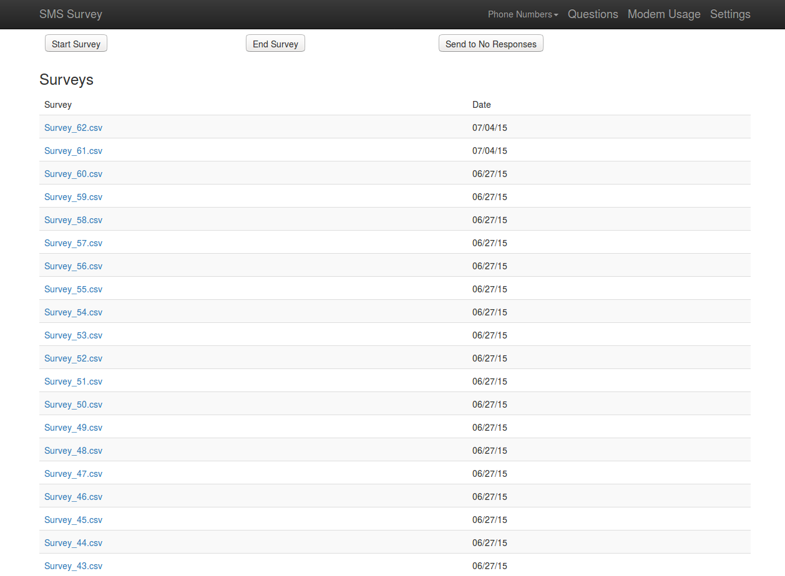
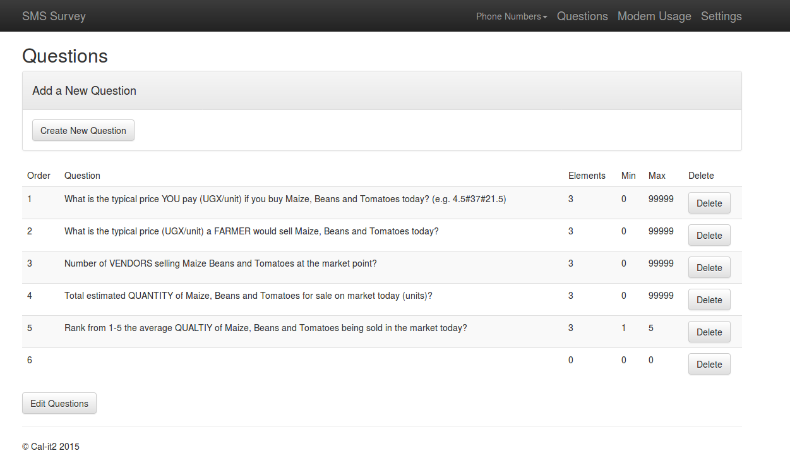
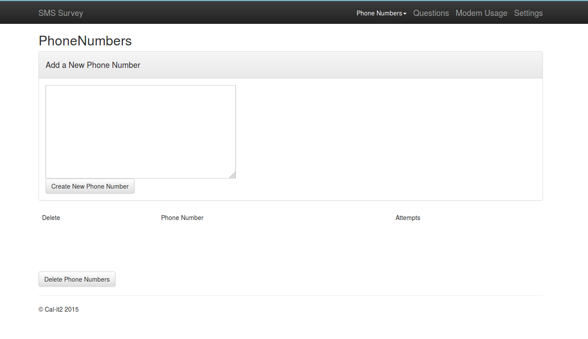
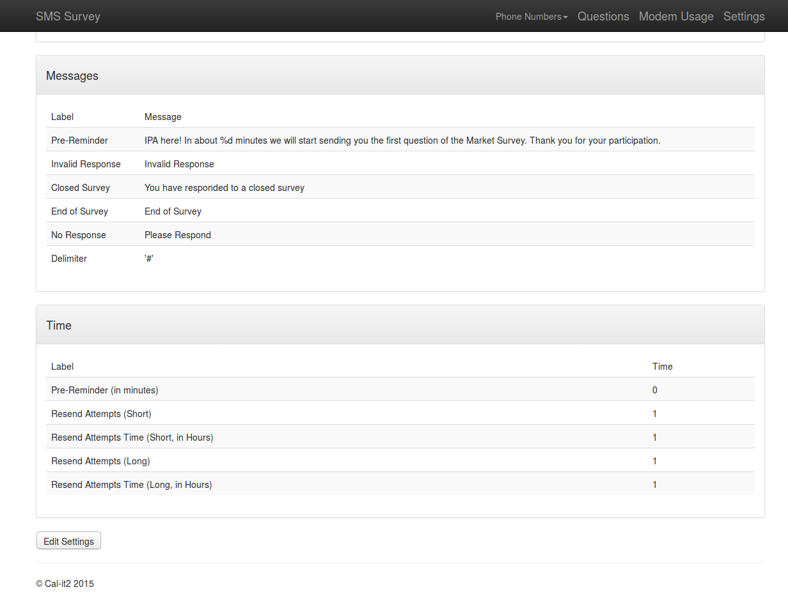

## SMSSurvey

SMSSurvey is a web application that expedites the sms-survey making process.
SMSSurvey is perfect for studies whose target audiences have texting capabilities.
Any question can be asked, and answers can have multiple parts, as well as numerical 
limits placed upon them. Create surveys using the web portal and connect a phone with
an active simcard, and you can now conduct surveys!

## Setting up

### Requirements
* [smstools3 package](http://smstools3.kekekasvi.com/index.php?p=)
* php5.6
* mysql
* composer
* apache server

We will assume the installation is on a linux system
### SMSTools3
Once smstools3 is downloaded, compiled and install, 
create the following directories in your /var/spool/sms folder
* outgoing
* checked
* failed
* incoming
* sent
* report

Then connect your phone and find what serial port it is connected too.
This will usually be connected to /dev/ttyACM0 or /dev/ttyS0. To find out,
diff the output of ls /dev/tty* before and after connecting the phone.

```bash
ls /dev/tty* > file1
#connect phone#
ls /dev/tty* > file2
diff file1 file2
```

Once you have found the directory set up your configuration file located
at /etc/smsd.conf file. An example configuration file:
```bash
# Global configuration
devices = RAZR
loglevel = 7
logfile = /var/log/sms/smstools.log

outgoing = /var/spool/sms/outgoing
checked = /var/spool/sms/checked
failed = /var/spool/sms/failed
incoming = /var/spool/sms/incoming
sent = /var/spool/sms/sent
report = /var/spool/sms/report

delaytime = 1
errorsleeptime = 12
blocktime = 180

autosplit = 3
receive_before_send = yes

# Modem configuration 
[RAZR]
device = /dev/ttyACM0
incoming = yes
report = yes
baudrate = 115200
report_device_details=yes
logfile=/var/log/razrsms.log
```
Note that each phone will have different configurations. Checkout smstools3
forum boards to find configurations for different modems/phones. 

Now send a test message using sendsms and a phone number:
```bash
sendsms 1234567890 "Message"
```

### SMSSurvey
We will now put the SMSSurvey software onto the computer
Execute the following commands:
```bash
git clone https://github.com/ajermaky/SMSSurvey
composer install
chmod -R 777 app/storage
php artisan migrate
php artisan migrate --package="liebig/cron"
```

Now we need to ensure our apache server can serve our software via web portal.
Edit your /etc/apache2/sites-enabled/000-default.conf file to include the following:
```bash
<VirtualHost *:80>
    ...
    DocumentRoot /var/www/SMSSurvey/public
    <Directory /var/www/SMSSurvey/public>
            Options -Indexes +FollowSymLinks +MultiViews
            AllowOverride All
            Order allow,deny
            allow from all
    </Directory>
    ...
</VirtualHost>
```
Now we need to connect the software to smstools3 driver. 
Modify /etc/smsd.conf to include an eventhandler:
```bash
eventhandler=/var/www/SMSSurvey/textArtisan.sh
```

Settup is now complete! Now a survey must be created.
## Creating a Survey
Click on the Questions tab

For every question click "Add a new Question". Then proceed to edit the questions.
Here you can signify how many answers you wish to have for each question, as well
as a minimum and maximum limit on the numerical values. You can even change
the order of the questions as needed.
Once your changes are done, submit and save.

Click on the Phones tab

Here enter in the phone numbers you wish to participate in the survey. This
can be a comma-separated list, so batch processing can be done here.

One you have submitted click on the Settings tab

Here you can change what type of messages you wish to have for different scenarios,
such as notifying invalid responses or stating if the survey has closed. The delimiter
to be used for answers can also be set here.
You can even set up time intervals for various events, such as how long
after a pre-reminder text the survey should begin, or to resend a message
if a person has not responded within a specified amount of time.

At this point the survey is now ready to go!
Go to the index page and click "start survey". When the survey is complete
go click end survey, and download the survey's csv file!
### License

SMSSurvey by Cal-it2 is open-sourced software licensed under the [MIT license](http://opensource.org/licenses/MIT)
